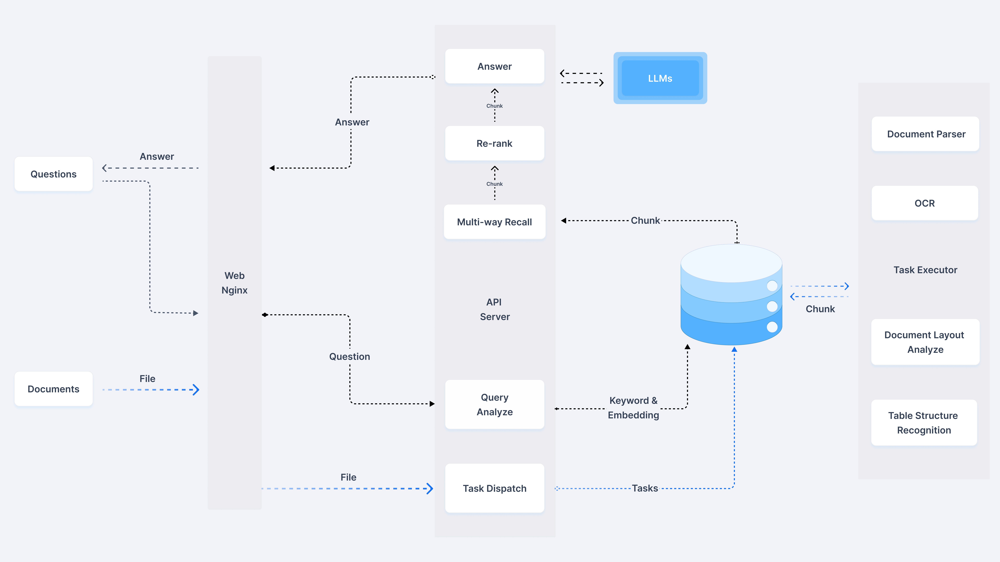

<!-- <div align="center">
<a href="http://localhost:81/">

</a>
</div> -->

## 💡 What is this repo?

[RAGFlow](https://ragflow.io/) is a famous open-source RAG (Retrieval-Augmented Generation) engine. This repo make the knowledege base part a stand alone system(and drop the rest parts like chat, agent, ...).

<!-- ## 🔎 System Architecture

<div align="center" style="margin-top:20px;margin-bottom:20px;">

</div> -->

## 🎬 Get Started

 Please follow the original [RAGFlow](https://github.com/infiniflow/ragflow) repo.

## 🔨 Launch service from source for development

1. Install uv, or skip this step if it is already installed:

   ```bash
   pipx install uv
   ```

2. Clone the source code and install Python dependencies:

   ```bash
   git clone https://github.com/infiniflow/ragflow.git
   cd ragflow/
   uv sync --python 3.10 --all-extras # install RAGFlow dependent python modules
   ```

3. Launch the dependent services (MinIO, Elasticsearch, Redis, and MySQL) using Docker Compose:

   ```bash
   docker compose -f docker/docker-compose-base.yml up -d
   ```

   Add the following line to `/etc/hosts` to resolve all hosts specified in **docker/.env** to `127.0.0.1`:

   ```
   127.0.0.1       es01 infinity mysql minio redis
   ```

4. If you cannot access HuggingFace, set the `HF_ENDPOINT` environment variable to use a mirror site:

   ```bash
   export HF_ENDPOINT=https://hf-mirror.com
   ```

5. Launch backend service:

   ```bash
   source .venv/bin/activate
   export PYTHONPATH=$(pwd)
   bash docker/launch_backend_service.sh
   ```

6. Install frontend dependencies:
   ```bash
   cd web
   npm install
   ```
7. Launch frontend service:

   ```bash
   npm run dev
   ```